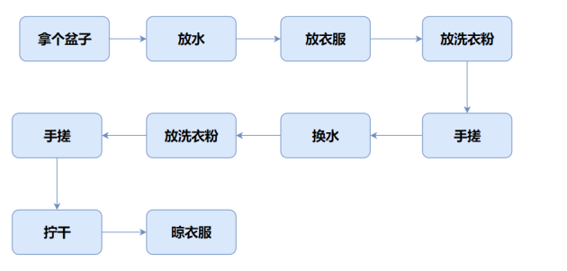
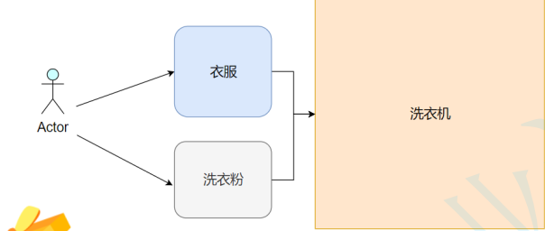
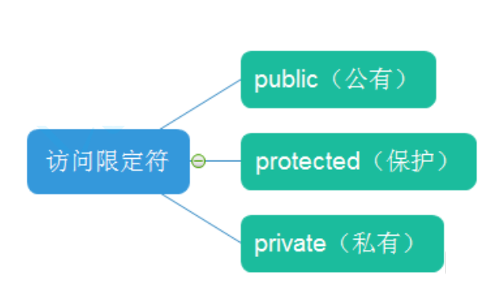

### C++类和对象（上）

### 【本节目标】

#### 1.面向过程和面向对象初步认识

#### 2.类的引入

#### 3.类的定义

#### 4.类的访问限定符及封装

#### 5.类的作用域

#### 6.类的实例化

#### 7.类的对象大小的计算

#### 8.类成员函数的 this 指针

<br><br>

### 1. 面向过程和面向对象初步认识

C 语言是面向过程的，顾名思义，面向过程就是关注过程，通过一个一个封装的函数来解决实际问题，拿洗衣服举例：


C++语言是基于面向对象的，重点关注的是对象，靠对象之间的交互完成。

在洗衣服的过程中，总共有四个对象，分别是：人，衣服，洗衣粉，洗衣机。


<br><br>

### 2. 类的引入

由于在 C 语言中，并没有类的概念，于是我们经常使用结构体（struct）来对某些变量进行封装，例如：

```C++
struct Person
{
    char name[20]; // 声明人的姓名
    int age;       // 声明人的年龄
    char sex[5];   // 声明人的性别
};
```

**注意**：struct Person 里的 name，age 和 sex 都是声明，并不是定义，因为内存并未给他们开辟空间，只有在使用结构体类型创建变量的时候才会给对象开辟对应的空间，至于开辟多少字节，大家可以去搜一搜**结构体的内存对齐**，我在这里不做过多的解释。

但是在 C++中，结构体内不仅可以定义变量，还可以定义函数，以我们在数据结构中学习的栈为例，用 C 语言实现的栈，结构体中只能定义变量，但是在 C++中，我们也可以定义相应的函数：

```C++
typedef int DataType;
struct Stack
{
    void Init(size_t capacity)
    {
        _array = (DataType*)malloc(sizeof(DataType) * capacity);
        if (nullptr == _array)
        {
            perror("malloc申请空间失败");
            return;
        }

        _capacity = capacity;
        _size = 0;

    }
    void Push(const DataType& data)
    {
        // 扩容
        _array[_size] = data;
        ++_size;
    }

    // 成员变量
    DataType* _array;
    size_t _capacity;
    size_t _size;

```

但是在上文中的定义，C++中更喜欢用 class 代替
<br><br>

### 3.类的定义

```C++
class className
{
    // 类体：由成员函数和成员变量组成
};  // 一定要注意后面的分号
```

class 为定义类的关键字，className 为类的名字，{}内为类的主体。

类体中的内容称为类的成员：类中的变量叫做类的成员变量，类中的函数称为类的方法或者成员函数。

为了方便，或者减少产生歧义，在声明类中成员变量的时候，通常习惯在变量名的前面加上"\_"，就像这样：

```C++
class Date
{
    public:
        void Init(int year)
        {
            mYear = year;
        }
    private:
        int mYear;
};
```

这里只是给大家一个建议，具体要求还是要等大家进入公司以后看公司的要求。
<br><br>

### 4. 类的访问限定符及封装



#### 4.1 访问限定符

C++语言中为类提供了三种访问限定符，分别是：

- public：
- protected:
- private:

**【访问限定符说明】**

1. public 修饰的成员在类外可以直接被访问
2. protected 和 private 修饰的成员在类外不能直接被访问(此处 protected 和 private 是类似的)
3. 访问权限作用域从该访问限定符出现的位置开始直到下一个访问限定符出现时为止
4. 如果后面没有访问限定符，作用域就到 } 即类结束。
5. class 的默认访问权限为 private，struct 为 public(因为 struct 要兼容 C)

**【面试题】**
\*\* C++中 struct 和 class 的区别是什么？

#### 4.2 封装

封装是计算机中比较重要的概念，其实不光在类中，计算机在很多地方都采取了封装的概念，让用户无需了解计算机的底层，也能很好的与计算机进行交互。

封装本质上是一种管理，让用户更方便使用类。比如：对于电脑这样一个复杂的设备，提供给用户的就只有开关机键、通过键盘输入，显示器，USB 插孔等，让用户和计算机进行交互，完成日常事务。但实际上电脑真正工作的却是 CPU、显卡、内存等一些硬件元件。

我们在之前了解过**流**的概念，那么什么是流呢？实际上就是采取了封装的概念。

我们可以使用键盘与计算机进行交互，流就是封装在计算机底层的一些东西，例如标准输入流（stdin），标准输出流（stdout）等等...

那么，在类中，我们可以适当的将成员变量进行私有化，同时提供一些接口，虽然用户直接访问不到类中成员变量，但是可以通封装好的一些接口，来获取类中的数据，这样既可以保证数据的安全，也可以满足用户的需求。

<br><br>

### 5. 类的作用域

C++中提供了一种叫域的概念，类就定义了一个新的作用域，在类外定义成员时，需要使用 **::** 操作符来指明。

```C++
class Person
{
    public:
        void PrintPersonInfo();
    private:
        char _name[20];
        char _gender[3];
        int _age;
};

// 这里需要指定PrintPersonInfo是属于Person这个类域
void Person::PrintPersonInfo()
{
    cout << _name << " "<< _gender << " " << _age << endl;
}
```

<br><br>

### 6. 类的实例化

顾名思义，类的实例化就是用类的类型创建对象的过程。

1. **类是对对象进行描述的**，是一个模型一样的东西，限定了类有哪些成员，定义出一个类并没有分配实际的内存空间来存储它；比如：入学时填写的学生信息表，表格就可以看成是一个类，来描述具体学生信息。
   **类就像谜语一样**，对谜底来进行描述，谜底就是谜语的一个实例。

2. 一个类可以实例化出多个对象，实例化出的对象，**占用实际的物理空间，存储类成员变量**。

<br><br>

### 7. 类对象模型

#### 7.1 如何计算类对象的大小

```C++
class A
{
    public:
        void PrintA()
        {
            cout<<_a<<endl;
        }
    private:
        char _a;
};

```

在结构体的章节中，我们学习了如何计算结构体的大小，那么在类中，我们如何计算类对象的大小呢？成员函数占不占空间呢？

我们可以编译一下这段代码，得出的答案是 class A 占据一个字节的大小。

这不由得让我们产生猜测，类对象是如何存储的？

#### 7.2 类对象存储方式的猜测

- 对象中包含类的各个成员
- 代码只保存一份，在对象中保存存放代码的地址
- 只保存成员变量，成员函数存放在公共的代码段

起初，外界对于类对象存储方式的猜测共有三种，其中第一种很快就被人否定了，因为存储起来过于冗余，既然成员函数都是一样的，为什么每个类对象都要存一份呢？

于是，人们有了第二种猜测，就是类对象中存储成员函数的地址，成员函数存储在一张表中。

第三种猜测就是，类对象中只保存成员变量，成员函数存放在公共的代码段。

那么，到底是哪种存储方式呢？似乎第三种看起来更合理。

其实，类对象是按照**第三种方式**进行存储的。

第三种存储方式就意味着，程序在编译链接时根据函数名去公共代码区找到函数的地址，不需要通过类对象来进行调用。

那么，既然是按照第三种方式存储的，那么我来考大家一道题。

下面程序的运行结果是什么？

```C++
class A
{
    private:
        int _a;
    public:
        void func()
        {
            cout << "call func()" << endl;
        }
}

int main()
{
    A* ptr = nullptr;
    ptr->func()
}

```

可能很多人会想说，这肯定程序崩溃了啊，空指针解引用了啊。

那我只能说，上面的内容你还是没有搞懂。

正确答案是正常运行，为什么？

因为类对象的成员函数存放在公共的代码段，在编译链接的时候直接调用，不需要通过对空指针进行解引用再来调用函数，现在理解了吗？
<br><br>

### 8. this 指针

#### 8.1 this 指针的引出

C++编译器给每个“非静态的成员函数“增加了一个隐藏的指针参数，让该指针指向当前对象(函数运行时调用该函数的对象)，在函数体中所有“成员变量”
的操作，都是通过该指针去访问。只不过所有的操作对用户是透明的，即用户不需要来传递，编译器自动完成。

#### 8.2 this 指针的特性

```C++
class Date
{
    public:
        void Init(int year, int month, int day)
        {
            _year = year;
            _month = month;
            _day = day;
        }

        void Print()
        {
            cout <<_year<< "-" <<_month << "-"<< _day <<endl;
        }

    private:
        int _year; // 年
        int _month; // 月
        int _day; // 日
};
int main()
{
    Date d1, d2;
    d1.Init(2022,1,11);
    d2.Init(2022, 1, 12);
    d1.Print();
    d2.Print();
    return 0;
}
```

那么到底什么是 this 指针？this 指针是指向类对象本身的，但是在使用的时候不需要用户来进行传递，编译器自动完成，也就是说，我们可以这样理解：

```C++
class Date
{
    public:
        void Init(Data* const this, int year, int month, int day)
        {
            _year = year;
            _month = month;
            _day = day;
        }

        void Print(Data* const this)
        {
            cout <<_year<< "-" <<_month << "-"<< _day <<endl;
        }

    private:
        int _year; // 年
        int _month; // 月
        int _day; // 日
};
int main()
{
    Date d1, d2;
    d1.Init(&d1, 2022,1,11);
    d2.Init(&d2, 2022, 1, 12);
    d1.Print();
    d2.Print();
    return 0;
}
```

只不过，我们在写的时候，省略了 this 指针，因为是编译器默认。

**注意**：

1. 实参和形参的位置不能显示传递和接受 this 指针，也就是说，我们上面写的代码本质是错误的，我写出来只是为了让大家更好地理解 this 指针。
2. 我们可以在成员函数内部使用 this 指针，例如：

```C++
void Init(Data* const this, int year, int month, int day)
        {
            this->_year = year;
            this->_month = month;
            this->_day = day;
        }
```

那么，有同学可能就会问了，this 指针存在哪里呢？

其实这个问题不难理解，this 指针毕竟是一个形参吗，编译器会为每个函数开辟栈帧的，那形式参数肯定是存在栈区上的。

但是，编译器可能会对 this 指针进行优化。

在 vs 编译器下传递 this 指针，是通过 ecx 寄存器传递的，这样做的好处是可以提高效率。
