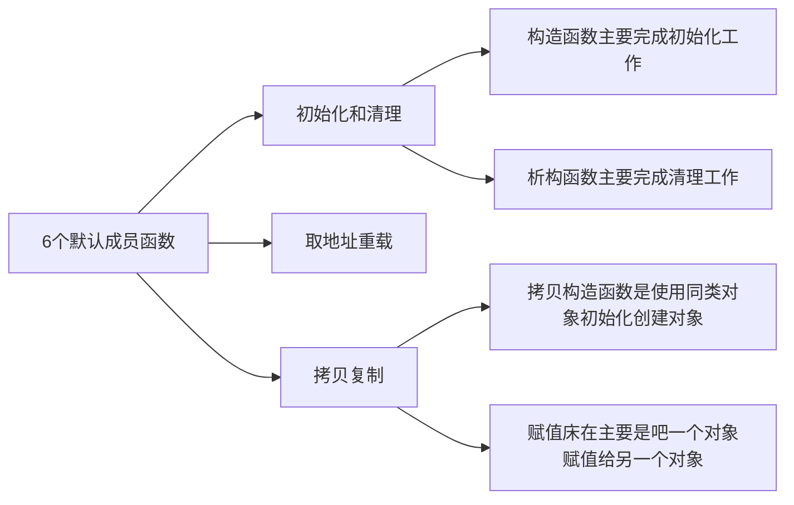

### 类和对象（中）

### 【本节目标】

- #### 1. 类的 6 个默认成员函数

- #### 2. 构造函数

- #### 3. 析构函数

- #### 4. 拷贝构造函数

- #### 5. 赋值运算符重载

- #### 6. const 成员函数

- #### 7. 取地址及 const 取地址操作符重载

<br>

### 1. 类的 6 个默认成员函数



<br><br>
取地址重载不怎么常用，大家了解即可，下面我们将依次介绍这几种函数。
<br>

### 2. 构造函数

#### 2.1 概念

对于这个 Date 类来说：

```C++
class Date
{
	public:
		void Init(int year, int month, int day)
		{
			_year = year;
			_month = month;
			_day = day;
		}

		void Print()
		{
			cout << _year << "-" << _month << "-" << _day << endl;
		}
	private:
		int _year;
		int _month;
		int _day;
};
```

对于这个 Date 类，我们实现两个成员方法，分别是初始化和打印，我们可以利用 Init 函数进行初始化，传递相应的参数，但是我们在实例化对象的时候都需要调用 Init 函数对其初始化，或者有时候，我们甚至忘记了初始化，会给我们造成很多麻烦。

我们知道，类对象是开辟在栈空间的，其成员变量当然也开辟在栈区，但是当我们忘记对其初始化的时候，问题就产生了，未初始化的成员变量是随机值啊，这可怎么办啊？

于是我们想，能不能有这样一种函数，在创建对象的时候，就自动地进行初始化呢？

我们的 C++大佬为我们提供这样一种函数，叫做**构造函数**。

**构造函数**是一个**特殊**的成员函数，名字与类名相同,创建类类型对象时由编译器自动调用，以保证每个数据成员都有一个合适的初始值，并且在对象整个生命周期内只调用一次。

#### 2.2 特性

**注意** ：构造函数是特殊的成员函数，其本质上也是一个函数，只不过比较特殊，其特征如下：

> 1. 函数名与类名相同。
> 2. 无返回值。
> 3. 对象实例化时编译器自动调用对应的构造函数。
> 4. 构造函数可以重载。

代码更改之后，如下：

```C++
class Date
{
	public:
		// 无参构造函数
		Date(){}

		// 带参构造函数
		Date(int year, int month, int day)
		{
			_year = year;
			_month = month;
			_day = day;
		}
	private:
		int _year;
		int _month;
		int _day;
};

int main()
{
	Date d1; // 调用无参构造函数，后面不用加括号
	Date d2(2023, 7, 30); // 调用带参构造函数
}
```

**注意**：

1. 如果调用无参构造函数，后面不用加括号
2. 如果类中没有显式定义构造函数，C++编译器会自动生成一个无参的默认构造函数，一旦用户显式定义，那么编译器就不再生成

这里，我需要讲一下，默认构造函数的概念，默认构造函数一共分三种：

- 我们不写，编译器自动生成的
- 我们自己写的，全缺省构造函数
- 我们自己写的，无参构造函数

**默认构造函数**的特点是：**不传参数就可以调用的**

当我们自己不写构造函数的时候，编译器会帮我们自动生成，但是有些同学可能发现，编译器自动帮我们生成的构造函数好像没什么用，因为我们通过 VS 的调试可以发现，编译器自动对类对象初始化之后，类对象的成员变量都还是随机值。

所以，很多同学会产生这样的疑惑：d 对象调用了编译器生成的默
认构造函数，但是 d 对象\_year/\_month/\_day，依旧是随机值。也就说在这里编译器生成的默认构造函数并没有什么用？？

在这里我要说一下，其实这是 C++当年编写语法的一个失误，C++将类型分为内置类型（也就是基本的类型）和自定义类型（通过 struct class 等自己创建的）。

**编译器自动生成的构造函数，对内置类型成员不做处理，对自定义类型成员会去掉它的默认构造函数（默认构造函数的定义在之前已经提及）**。

C++11 打了一个补丁，允许我们在声明变量的时候赋一个初始值，来弥补对内置类型成员不做处理的失误，想这样：

```C++
class Date
{
	private:
		int _year = 1;   // 注意，这里不是初始化，而是声明
		int _month = 1;
		int _day = 1;
};
```

谈完了失误，接下来我们来谈一谈如何自己实现构造函数：

1. 一般的类都不会让编译器默认生成构造函数，都会自己写。
2. 我们自己写一个全缺省的构造函数，非常好用
3. 只有特殊情况才会让编译器自动生成

特殊情况是指嵌套类的情况，比如我们在 C 语言实现简单数据结构的时候，用两个栈来实现一个队列，这个时候我们就不需要写队列的构造函数，只需要写栈的构造函数，至于其他的内置数据类型，我们可以直接在声明的时候给初始值。

### 3. 析构函数
